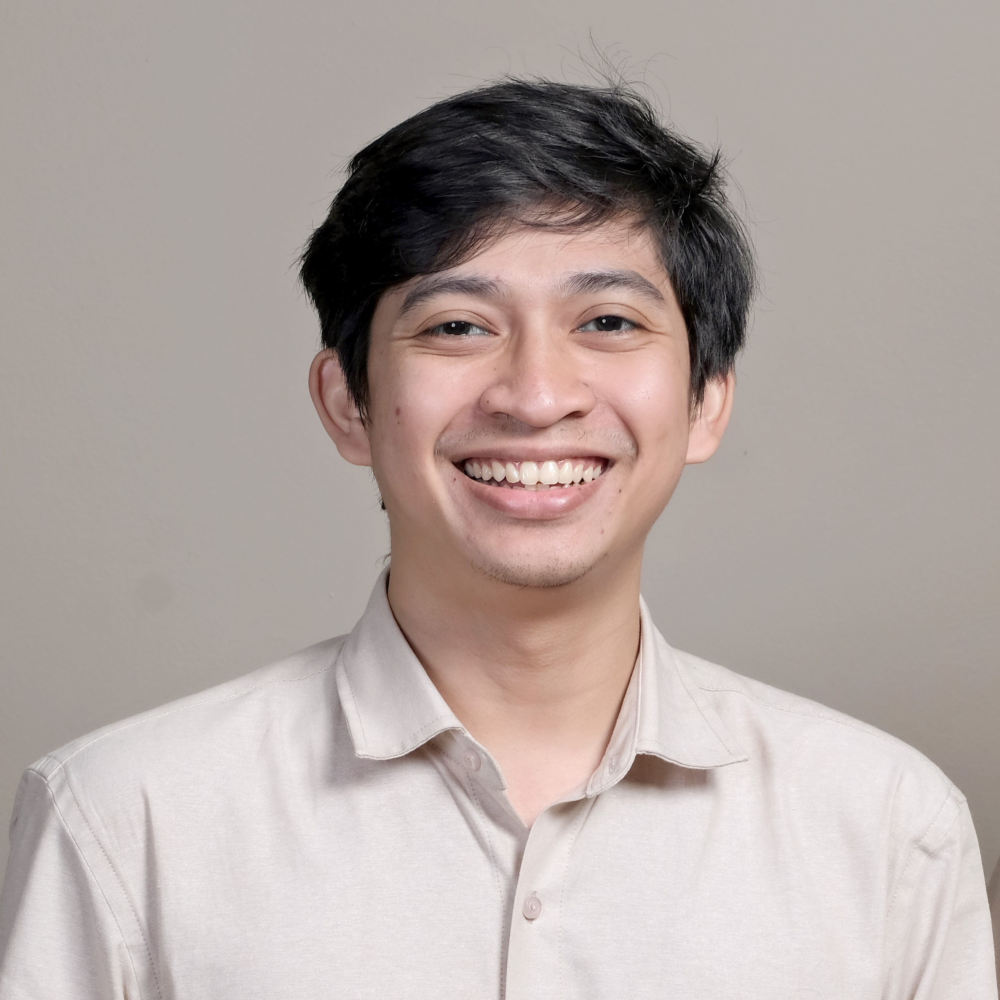

<!-- RevoU Logos -->

<!-- { width="20%" style="display: block; margin: 0 auto; max-height: 300px;"} -->

<!-- Header md file -->

# Muhammad Adrisa Nur Syarif

<!-- Purpose -->
> This is an assignment for "My Profile"

<!-- Navigation -->
Table of Content :memo:

-  [About Me](#Profile-triangular_flag_on_post "About Me")
-  [Skills](#Skills-briefcase "My Skills")
-  [Experience](#Experience-rocket "My Experience")
-  [Contact](#Get-In-Touch-mailbox_with_mail "My Contact")

---

<!-- Content 1: About Me -->

## Profile :triangular_flag_on_post:
### I'm Adrisa 	:bangbang:

###### a Software Engineering student's at RevoU[^1].

<!-- Footnote RevoU site -->
[^1]: [RevoU registration](https://revou.co/software-engineering?&eid=1697019632813&targeting=1&cat=D&x6=K)

<!-- Profile image -->

<!-- { width="50%" style="display: block; margin: 0 auto; max-height: 300px; object-fit: cover; object-position: center; border-radius: 10px;"} -->

#### Hello. 
<!-- {style="text-align: center;"} -->

<!-- About me -->
I am a **Strategy and Policy Analyst**. Spesialization in System Dynamics Modeller. I'm the co-founder of *Sysdyncate*. I :heart: coffee and cat. I started learning to code when I was 24 years old because I wanted to make my own website [Hisa Studio](https://www.hisastudio.com/ "Hisa Studio Site"). My goals is to be professional software engineer.

<!-- My Skills -->

## Skills :briefcase:

- As an analyst, i have skill to using several tools:
  - Python
  - Ms Excel
  - Power BI
  - Some SQL Querry

- But my best skill is actually in googling something. As an analyst I need to find many dataset. Of course the data can be obtain by google. :desktop_computer:

## Experience :rocket:

I reside in Bandung, which has allowed me to acquire the necessary skills for living in this city. I previously held the position of Major in Physics Instrumentation. However, I am currently pursuing my bachelor's degree at Pasim National University to achieve my academic goals.

Throughout this time, I've embarked on a non-linear career journey, starting from design for marketing and books, eventually transitioning into an analyst role. Here is a brief overview of my career so far.

|Years|Occupation|Position| 
|-----------|--------|-------|
|2023 - Now | PT GITS Indonesia | Storage Moderation |
|2023 - Now | PT Quatra Inti Karya | Project Admin |
|2022 - Now | Publish What You Pay | Data Analyst |
|2022 - 2023 | PT Sinovatif | Internship |
|2022 - 2023 | PT Hegar Daya | Data Analyst |
|2020 - Now | Sysdyncate | Co Founder |
|2018 - 2020 | System Dynamics Bandung Bootcamp | System Dynamics Modeller |

## Get In Touch :mailbox_with_mail:
If you love coffee as much as I do. 
Love coffee as much as I do? Let's talk about how awesome they are! We can code while we drink hot coffee! :coffee:

